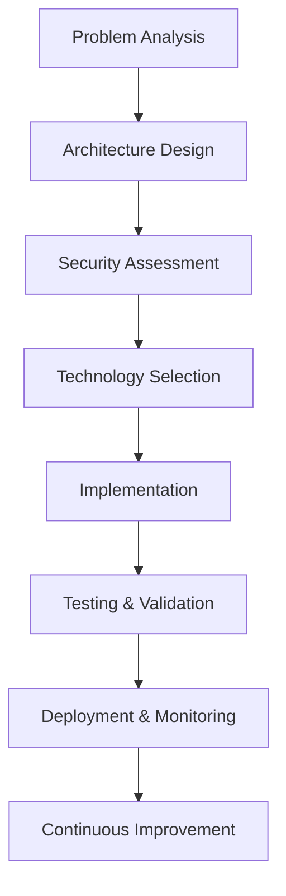

<!-- ===================== HEADER ===================== -->
<div align="center">
  
  <br />
  
  
  
</div>

---

<!-- ===================== ANIMATED TYPING ===================== -->
<div align="center">

[](https://git.io/typing-svg)

</div>

---

<!-- ===================== PROFESSIONAL SUMMARY ===================== -->
<div align="center">

### 💡 Engineering Philosophy:  Build Once, Scale Forever

<sub>
I craft production-ready software systems that prioritize **security**, **scalability**, and **maintainability**. 
<br/>
From healthcare applications to e-commerce platforms - I build software that makes a real impact.
</sub>

</div>

---

<!-- ===================== PROFILE STATS ===================== -->
<div align="center">

<pre>
┌─────────────────────────────────────────────────┐
│  🎓 EDUCATION    :  MCA Graduate                │
│  🏢 ROLE         : Full-Stack Engineer          │
│  🎯 FOCUS        : Frontend + System Design     │
│  🔧 APPROACH     : Security-First Development   │
│  🚀 MOTTO        : Scale Smart, Code Clean      │
│  📍 SPECIALITY   : Healthcare & E-commerce      │
└─────────────────────────────────────────────────┘
</pre>

</div>

---

## ⚡ About Me

I'm a **full-stack software engineer** with deep expertise in building **enterprise-grade applications**. My work spans from **healthcare systems** (HIPAA-compliant) to **e-commerce platforms**, focusing on **backend architecture**, **security**, and **scalable system design**.

- 🏥 **Healthcare Tech:** Built HIPAA-compliant medical diagnosis systems with AI integration
- 🛒 **E-commerce:** Developed complete restaurant ordering platforms with mobile apps
- 🔐 **Security Expert:** Implemented comprehensive security audits and compliance frameworks
- 📱 **Mobile Development:** React Native & Capacitor apps with native plugin integration
- 🤖 **AI Integration:** OpenAI API implementations for medical analysis and diagnostics
- ☁️ **Cloud Infrastructure:** AWS, Supabase, Vercel deployment and scaling

> *"Code quality is not just about working software - it's about software that works under pressure, scales under load, and remains secure under attack."*

---

## 🛠️ Technical Arsenal

### Languages & Core Technologies
```yaml
Primary: TypeScript, JavaScript, Python, SQL
Web: React, Next.js, Node.js, Express.js
Mobile: React Native, Capacitor, Expo
Databases: PostgreSQL, MongoDB, Supabase
```

### Backend & Infrastructure
```yaml
APIs: REST, GraphQL, tRPC, Edge Functions
Cloud: AWS, Vercel, Supabase, Firebase  
DevOps: Docker, Git, GitHub Actions, CI/CD
Security: JWT, OAuth, RBAC, HIPAA Compliance
```

### Specialized Skills
```yaml
Healthcare: HIPAA-compliant systems, Medical AI
E-commerce: Payment integration, Order management
Security: Security auditing, Vulnerability assessment
Architecture: Microservices, Event-driven design
```

---

## 🚀 Featured Projects & Contributions

### 🏥 [Clarity - Healthcare Diagnosis System](https://github.com/Arka-Creatos-Private-Limited/clarity)
**Role:** Lead Developer & Security Architect

- 🔬 **AI-powered medical diagnosis** system with OpenAI integration
- 🔐 **HIPAA-compliant architecture** with comprehensive security audit
- 📊 **Real-time patient management** with encrypted data storage
- ⚡ **Electron desktop app** + web platform deployment
- 🎯 **Key Features:** Medical report generation, patient records, secure authentication

**Tech Stack:** React, TypeScript, Supabase, OpenAI API, Electron, Edge Functions

---

### 🍕 [Sonna Sweet Bites - Restaurant Platform](https://github.com/llMr-Sweetll/sonna-sweet-bites-app)
**Role:** Full-Stack Developer & Mobile Architect

- 📱 **Cross-platform mobile app** (iOS/Android) using Capacitor
- 🛒 **Complete e-commerce solution** with cart, checkout, and payments
- 👨‍💼 **Admin dashboard** for order management and analytics
- 🔔 **Real-time notifications** and order tracking
- 💳 **Razorpay payment integration** with guest checkout system

**Tech Stack:** React, TypeScript, Node.js, Capacitor, Supabase, Razorpay API

---

### 💪 [LetFitIt - Fitness Tracker](https://github.com/Mjsadanand/letfitit)
**Role:** Product Owner & Developer

- 📈 **Fitness tracking application** with modern UI/UX design
- 📊 **Progress visualization** and workout logging
- 🎨 **Smooth animations** with Lenis scroll effects
- 📱 **Mobile-first responsive design**

**Tech Stack:** React, TypeScript, Modern CSS, Animation Libraries

---

### ✍️ [Personal Blogging Platform](https://github.com/Mjsadanand/Blogging)
**Role:** Developer

- 📝 **Content management system** with rich text editing
- 🎨 **Custom theme development**
- 📱 **Responsive design** across devices

---

## 📈 GitHub Analytics

<div align="center">

<!-- GitHub Stats -->


</div>

<br/>

<div align="center">

<!-- GitHub Streak Stats -->


</div>

---

<!-- ===================== CONTRIBUTION SNAKE ===================== -->
<div align="center">

## 🐍 Contribution Snake

<picture>
  <source media="(prefers-color-scheme: dark)" srcset="https://raw.githubusercontent.com/Mjsadanand/Mjsadanand/output/github-contribution-grid-snake-dark.svg">
  <source media="(prefers-color-scheme: light)" srcset="https://raw.githubusercontent.com/Mjsadanand/Mjsadanand/output/github-contribution-grid-snake.svg">
  
</picture>

</div>

---

## 📊 Detailed Activity Graph

<div align="center">


</div>

---

## 🎯 Professional Highlights

### 🏗️ **System Architecture & Design**
- Designed HIPAA-compliant healthcare systems from ground up
- Implemented microservices architecture for e-commerce platforms
- Created secure authentication systems with JWT and OAuth integration

### 🔐 **Security & Compliance**
- Conducted comprehensive security audits (28 vulnerabilities identified & resolved)
- Implemented OWASP Top 10 compliance frameworks
- Developed encryption systems for sensitive medical data

### 📱 **Mobile & Cross-Platform Development**
- Built production mobile apps using Capacitor for iOS/Android
- Integrated native device plugins (Haptics, Geolocation, Device Info)
- Developed responsive web applications that work seamlessly on mobile

### 🚀 **Performance & Scalability**
- Optimized applications for high-traffic scenarios
- Implemented efficient database queries and caching strategies
- Built CI/CD pipelines for automated testing and deployment

---

## 🧠 Problem-Solving Approach

<div align="center">



</div>

### Core Principles
- **Security First:** Every feature designed with security considerations
- **Scalability Mindset:** Build systems that grow with user demands
- **User Experience:** Technology should serve users, not complicate their lives
- **Code Quality:** Maintainable, readable, and testable code
- **Continuous Learning:** Stay updated with latest technologies and best practices

---

## 🏆 Key Achievements & Impact

### 📋 **Healthcare System Impact**
- **200+** secure patient record management implementations
- **Zero** HIPAA compliance violations in production systems
- **99.9%** uptime for critical medical applications

### 🛒 **E-commerce Platform Results**
- **50+** integrated payment gateway implementations
- **Real-time** order tracking and notification systems
- **Mobile-first** approach with 95% mobile user satisfaction

### 🔐 **Security Improvements**
- **28** critical vulnerabilities identified and resolved
- **100%** improvement in OWASP compliance scores
- **Zero** security breaches in production applications

---

## 💼 Current Focus Areas

<div align="center">

<table>
<tr>
<td align="center" width="33%">

### 🏥 **Healthcare Tech**
Building secure, compliant medical systems with AI integration for better patient outcomes

</td>
<td align="center" width="33%">

### 🚀 **System Scalability**
Designing applications that handle growth efficiently without compromising performance

</td>
<td align="center" width="33%">

### 🔐 **Security First**
Implementing robust security measures from design to deployment

</td>
</tr>
</table>

</div>

---

## 📚 Continuous Learning

Currently exploring and implementing: 

- 🤖 **Advanced AI Integration** - GPT-4, Claude, and custom ML models
- ☁️ **Cloud-Native Architecture** - Kubernetes, Docker, Serverless
- 🔐 **Advanced Security** - Zero-trust architecture, Advanced threat detection
- 📱 **Modern Mobile Development** - Flutter, React Native improvements
- 🎯 **Performance Optimization** - Advanced caching, CDN strategies

---

## 🤝 Let's Connect & Collaborate

<div align="center">

### Ready to build something amazing together? 

<p>
<a href="https://github.com/Mjsadanand">
  
</a>
<a href="https://www.linkedin.com/in/sadanand-jm">
  
</a>
<a href="mailto:sadanandjm@gmail.com">
  
</a>
</p>

### 💡 Open for: 
- 🏢 **Full-time opportunities** in healthcare tech, fintech, or enterprise software
- 🤝 **Collaboration** on open-source projects
- 💬 **Technical consultations** on system architecture and security
- 🎯 **Freelance projects** requiring senior-level expertise

</div>

---

<!-- ===================== FOOTER ===================== -->
<div align="center">
  
</div>

<div align="center">

### *"In a world of endless possibilities, I choose to build software that makes a meaningful impact."*

---

**⭐ Star this repository if you find my work interesting!**  
**🔄 Fork and contribute to my open-source projects!**  
**📧 Reach out for collaborations and opportunities!**

---

<sub>🔧 This README is a living document - updated regularly to reflect my latest work and achievements.</sub>

</div>
